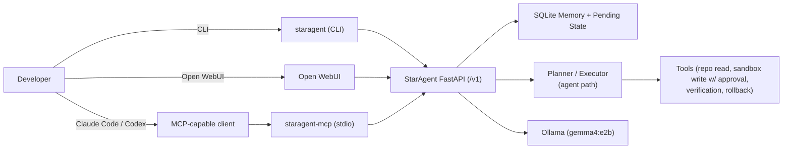
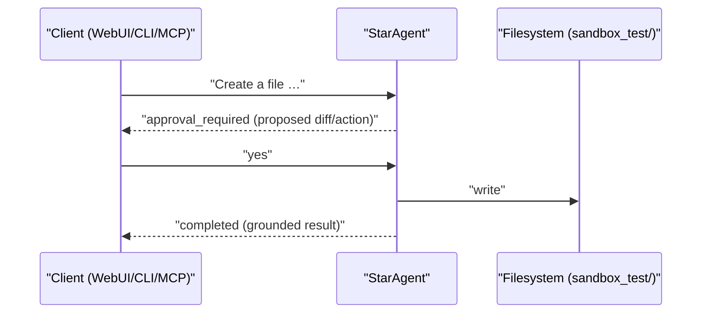

# StarAgent

Local, long-horizon AI engineering runtime for Ollama: OpenAI-compatible API, CLI, Open WebUI integration, and an MCP server for Claude Code and Codex.

StarAgent is designed to be a practical control plane over a local model such as `gemma4:e2b` (Ollama stays the inference plane).

## What StarAgent Is

StarAgent sits between your clients and Ollama and provides:

- fast-path chat for normal Q&A
- agent-path execution for repo inspection and multi-step tasks
- long-horizon memory stored in SQLite (project and conversation scoped)
- approval-gated writes (no silent filesystem writes)
- continuation and resume (`yes` / `continue`)
- verification and rollback flows

## Surfaces

| Surface | What you use | Typical use |
|---|---|---|
| OpenAI-compatible API | `http://127.0.0.1:8095/v1` | Open WebUI, local apps |
| CLI | `staragent …` | terminal workflows |
| Open WebUI | point WebUI to StarAgent | chat UI + approvals |
| MCP server | `staragent-mcp` | Claude Code / Codex tool calls |

## Architecture



## Workflow: Approval + Resume



## Quickstart (Local)

Prereqs:

- Python 3.9+
- Ollama running on `http://127.0.0.1:11434`
- Model installed (default: `gemma4:e2b`)

Bootstrap and run:

```bash
./scripts/bootstrap_staragent.sh
./scripts/start_staragent.sh
./scripts/smoke_test_staragent.sh
./scripts/stop_staragent.sh
```

Manual sanity checks:

```bash
curl -s http://127.0.0.1:8095/health | python3 -m json.tool
curl -s http://127.0.0.1:8095/v1/models | python3 -m json.tool
```

## CLI Examples

```bash
staragent status
staragent ask "Reply with exactly: OK"
staragent agent "Inspect the app folder and identify the main API entry file."
```

Approval-gated write (sandbox only):

```bash
staragent agent "Create sandbox_test/hello.txt with content: hello"
staragent approve
```

## Open WebUI Setup

See [docs/OPEN_WEBUI_SETUP.md](docs/OPEN_WEBUI_SETUP.md).

StarAgent exposes an OpenAI-compatible API. WebUI typically needs:

- Base URL: `http://host.docker.internal:8095/v1` (if WebUI is in Docker)
- API key: your `PROXY_API_KEY` (local default is acceptable for local-only use)
- Model: `gemma4:e2b`

## MCP (Claude Code / Codex) Setup

See:

- [docs/MCP_SETUP.md](docs/MCP_SETUP.md)
- [docs/CLAUDE_CODE_MCP_SETUP.md](docs/CLAUDE_CODE_MCP_SETUP.md)
- [docs/CODEX_MCP_SETUP.md](docs/CODEX_MCP_SETUP.md)

Start MCP server (stdio):

```bash
./scripts/start_staragent_mcp.sh
```

## Repo Layout

- `app/`: FastAPI runtime, memory, planner/executor, tools, approval, verification/rollback
- `client/`: shared HTTP client used by CLI and MCP
- `cli/`: `staragent` and legacy `macagent` CLI entrypoints
- `mcp/`: MCP server and stdio transport
- `scripts/`: bootstrap, start/stop, smoke/validate, release helpers
- `docs/`: setup docs and evaluation notes
- `templates/`: prompt templates

## Compatibility Notes

StarAgent preserves legacy `macagent` CLI/MCP names and `MACAGENT_*` environment variables for now. See [docs/COMPATIBILITY_MAP.md](docs/COMPATIBILITY_MAP.md).

## Known Limitations (Honest)

- Local model quality varies; small models may need careful prompting.
- StarAgent is local-first. Do not expose the API to untrusted networks without hardening auth and transport.
- Persistence has been hardened into SQLite, but operational edge cases should still be validated in your environment.

## Status

Technical release ready: developer-focused, local-first, and meant for iterative hardening with real usage.
